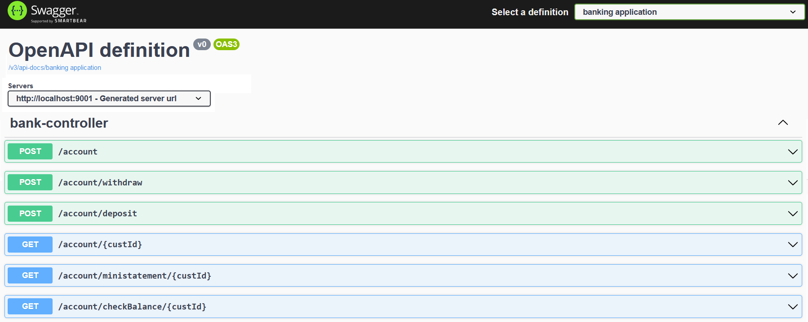
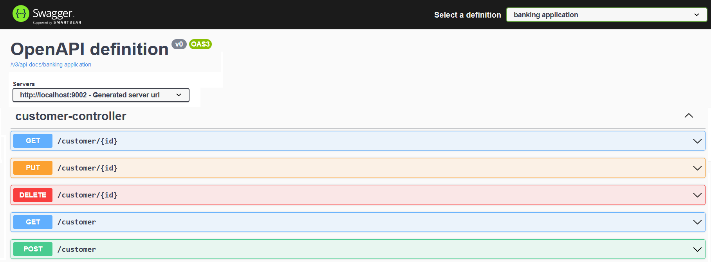

## API Documentation using OpenAPI
API documentation will be really helpful to understand the API request, and it's response. It's really helpful for the developers to improve the productivity by accessing this API documentation.

### Service Details:
___
I have created the below 3 services and specify the more details about the services

`service-registry`: It's responsible for registering all services into Eureka server for service discovery. It will help to locate the services very easily.

`banking-services`: It's responsible for creating new account, deposit/withdraw the amount, get the customer details, check balance and monitor all transactions.

`customer-service`: It's responsible for all CURD operation related to customer


|S.No| Service-Name|Port| API                            |H2-console| DB Url |
-----|-------------|----|--------------------------------|----------|--------|
1| service-registry|8761| N/A                            |N/A| N/A    |
2| banking-service|9001| http://localhost:9001/account  |http://localhost:9001/h2-console| jdbc:h2:mem:banking |
3| customer-service|9002| http://localhost:9002/customer |http://localhost:9002/h2-console|jdbc:h2:mem:customer|

### Access API Documentation Page:
___
The `banking-service` OpenAPI API documentation can be accessed through http://localhost:9001/swagger-ui/index.html url and download the api details in JSON format from http://localhost:9001/v3/api-docs url. 

Please refer the below screenshot for your reference.



The `customer-service` OpenAPI API documentation can be accessed through http://localhost:9002/swagger-ui/index.html url and download the api details in JSON format from http://localhost:9002/v3/api-docs url. 

Please refer the below screenshot for your reference.



### API Details:
___
Please refer the below list of APIs provided by the `banking-service`

**POST** http://localhost:9001/account

Payload:
```
{
    "name": "Arun",
    "amount": 2000.0,
    "phone": "xxxxxxxxxx",
    "email": "xxxx@gmail.com"
}
```
Response: 
```
{
    "status": "success",
    "message": "Successfully created the bank account",
    "customerId": 1,
    "accountNo": 45877048
}
```

**POST** http://localhost:9001/account/deposit

Payload:
```
{
    "customerId": 1,
    "accountNo": 45877048,
    "amount": 1000.0
}
```
Response: 
```
{
    "status": "success",
    "message": "Successfully updated the balance",
    "balance": 3000.0
}
```

**POST** http://localhost:9001/account/withdraw

Payload:
```
{
    "customerId": 1,
    "accountNo": 45877048,
    "amount": 500.0
}
```
Response: 
```
{
    "status": "success",
    "message": "Successfully updated the balance",
    "balance": 2500.0
}
```

**GET** http://localhost:9001/account/{custId}

Response: 
```
{
    "id": 1,
    "name": "Arun",
    "accountNo": 45877048,
    "balance": 4000.0,
    "phone": "xxxxxxxxxx",
    "emailId": "xxxx@gmail.com"
}
```

**GET** http://localhost:9001/account/checkBalance/{custId}

Response: ```Arun your account number 45877048 has balance Rs:2500.0```

**GET** http://localhost:9001/account/ministatement/{custId}

Response: 
```
{
    "name": "Arun",
    "customerId": 1,
    "accountNo": 45877048,
    "balance": 2500.0,
    "transactions": [
      {
        "customerId": 1,
        "accountNo": 45877048,
        "transactionType": "ACCOUNT_CREATED",
        "amount": 2000.0,
        "date": "16-10-2022 22:48:47",
        "id": 1
      },
      {
        "customerId": 1,
        "accountNo": 45877048,
        "transactionType": "CREDIT",
        "amount": 1000.0,
        "date": "16-10-2022 22:49:29",
        "id": 2
      },
      {
        "customerId": 1,
        "accountNo": 45877048,
        "transactionType": "DEBIT",
        "amount": 500.0,
        "date": "16-10-2022 22:49:49",
        "id": 3
      }
    ]
}
```

Actually the above APIs are internally make a call to `customer-service` to fetch the actual response. The `customer-service` also exposed the APIs which can be accessed directly.

Please refer the below list of APIs provided by the `customer-service`

**GET** http://localhost:9002/customer/

Response: 
```
[
  {
    "id": 1,
    "name": "Arun",
    "accountNo": 45877048,
    "balance": 2000.0,
    "phone": "xxxxxxxxxx",
    "emailId": "xxxx@gmail.com"
  }
]
```

**GET** http://localhost:9002/customer/{custId}

Response: 
```
{
    "id": 1,
    "name": "Arun",
    "accountNo": 45877048,
    "balance": 2000.0,
    "phone": "xxxxxxxxxx",
    "emailId": "xxxx@gmail.com"
}
```

**POST** http://localhost:9002/customer

Payload:
```
{
    "name":"Arun",
    "amount": 2000.0,
    "phone":"xxxxxxxxxx",
    "emailId":"xxxx@gmail.com"
}
```
Response: 
```
{
    "id": 1,
    "name": "Arun",
    "accountNo": 45877048,
    "balance": 2000.0,
    "phone": "xxxxxxxxxx",
    "emailId": "xxxx@gmail.com"
}
```

**PUT** http://localhost:9002/customer/{custId}

Payload:
```
{
    "id": 1,
    "accountNo": 45877048,
    "amount": 5000.0
}
```
Response: 
```
{
    "id": 1,
    "name": "Arun",
    "accountNo": 45877048,
    "balance": 5000.0,
    "phone": "xxxxxxxxxx",
    "emailId": "xxxx@gmail.com"
}
```

**DELETE** http://localhost:9002/customer/{custId}

Response: ```None```

### Start and access Eureka server:
___
>**Note:** *We need to start the `service-registry` service before starting of any services(`banking-service`/`customer-service`) to be registered with Eureka server.*

Finally, the `banking-service` and `customer-service` are registered with Eureka server which is running on the URL http://localhost:8761/. You can access the URL from the browser to see the list of services registered with Eureka server.