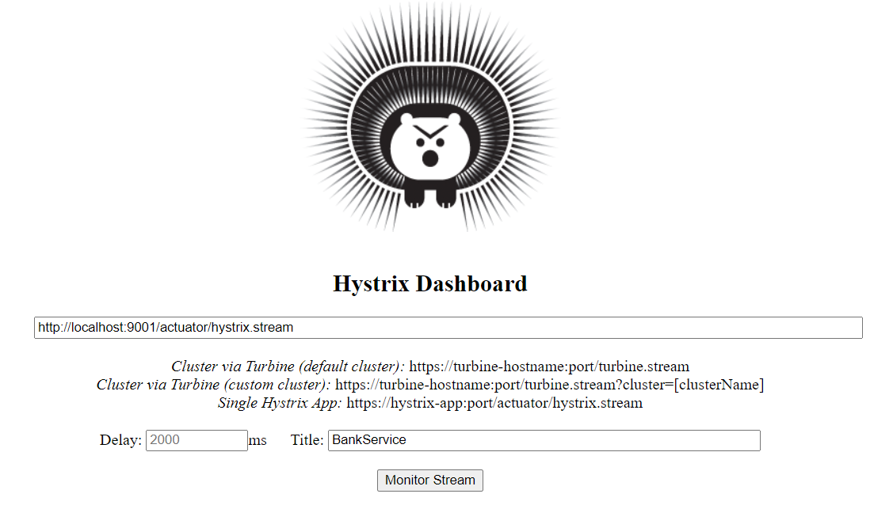
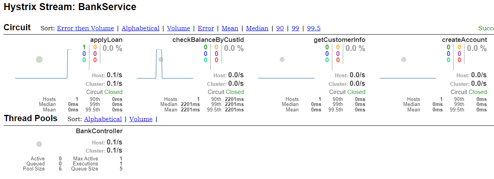
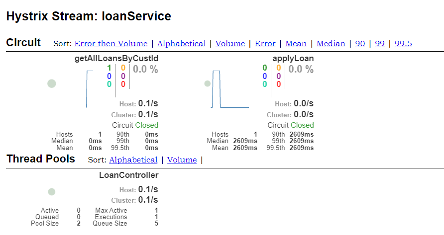
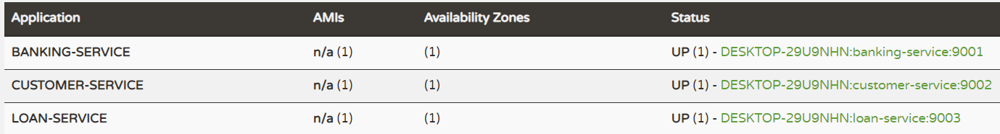

## Implement circuit-breaker pattern using Hystrix
Circuit-breaker pattern is essential while any one of the services might be down it shouldn't impact the response for the other services. So, the failed services input only getting affected and other details still we can access the data.
We can monitor the circuit-breaker pattern through Hystrix-Dashboard.

### Service Details:
___
I have created the below 4 services and specify the more details about the services

`service-registry`: It's responsible for registering all services into Eureka server for service discovery. It will help to locate the services very easily.

`banking-services`: It's responsible for creating new account, apply for loan, get the customer details and check balance.

`customer-service`: It's responsible for all CURD operation related to customer

`loan-service`: It's responsible for check for loan eligibility, approve/decline the loan and validating the customer details.

|S.No| Service-Name|Port| API                            | H2-console                       | DB Url               |
-----|-------------|----|--------------------------------|----------------------------------|----------------------|
1| service-registry|8761| N/A                            | N/A                              | N/A                  |
2| banking-service|9001| http://localhost:9001/account  | N/A                              | N/A                  |
3| customer-service|9002| http://localhost:9002/customer | http://localhost:9002/h2-console | jdbc:h2:mem:customer |
4| loan-service|9003| http://localhost:9003/loan     | http://localhost:9003/h2-console | jdbc:h2:mem:loan     |

The hystrix dashboard can be accessed though the below urls and the dashboard will look like below


1. http://localhost:9001/hystrix
2. http://localhost:9003/hystrix

We need to define the hystrix streams by `http://{host}:{port}/actuator/hystrix.stream` and given the title then click on `Monitor Stream` button to monitor all the request with statistic details.
The `banking-service` and `loan-service` streams will look like below





### API Details:
___
Please refer the below list of APIs provided by the `banking-service`

**POST** http://localhost:9001/account

Payload:
```
{
    "name": "Arun",
    "amount": 2000.0,
    "phone": "xxxxxxxxxx",
    "email": "xxxx@gmail.com"
}
```
Response: 
```
{
    "status": "success",
    "message": "Successfully created the bank account",
    "customerId": 1,
    "accountNo": 45877048
}
```

**POST** http://localhost:9001/account/loan

Payload:
```
{
    "name":"Arun",
    "age": 39,
    "custId":1,
    "accountNo": 45877048,
    "income": 30000,
    "employmentType": "MNC",
    "amount": 200000.0,
    "tenture": 24
}
```
Response: 
```
{
    "id": 1,
    "status": "ACCEPTED",
    "message": "You are eligible for the loan",
    "amount": 200000.0,
    "tenture": 24
}
```

**GET** http://localhost:9001/account/{custId}

Response: 
```
{
    "id": 1,
    "name": "Arun",
    "accountNo": 45877048,
    "balance": 4000.0,
    "phone": "xxxxxxxxxx",
    "emailId": "xxxx@gmail.com",
    "loanDetails": [
      {
        "id": 1,
        "amount": 200000.0,
        "tenture": 24,
        "customerId": 1,
        "accountNo": 45877048
      }
    ]
}
```

**GET** http://localhost:9001/account/checkBalance/{custId}

Response: ```Arun your account number 45877048 has balance Rs:2500.0```

Actually the above APIs are internally make a call to `customer-service` and `loan-service` to fetch the actual response. The `customer-service` also exposed the APIs which can be accessed directly.

Please refer the below list of APIs provided by the `customer-service`

**GET** http://localhost:9002/customer/{custId}

Response: 
```
{
    "id": 1,
    "name": "Arun",
    "accountNo": 45877048,
    "balance": 2000.0,
    "phone": "xxxxxxxxxx",
    "emailId": "xxxx@gmail.com"
}
```

**POST** http://localhost:9002/customer

Payload:
```
{
    "name":"Arun",
    "amount": 2000.0,
    "phone":"xxxxxxxxxx",
    "emailId":"xxxx@gmail.com"
}
```
Response: 
```
{
    "id": 1,
    "name": "Arun",
    "accountNo": 45877048,
    "balance": 2000.0,
    "phone": "xxxxxxxxxx",
    "emailId": "xxxx@gmail.com"
}
```

Please refer the below list of APIs provided by the `loan-service`

**GET** http://localhost:9003/loan/{loanId}

Response: 
```
{
    "id": 3,
    "amount": 200000.0,
    "tenture": 24,
    "customerId": 1,
    "accountNo": 45877048
}
```

**POST** http://localhost:9003/loan

Payload:
```
{
    "name":"Arun",
    "age": 39,
    "custId":1,
    "accountNo": 45877048,
    "income": 40000,
    "employmentType": "MNC",
    "amount": 250000.0,
    "tenture": 36
}
```
Response: 
```
{
    "id": 5,
    "status": "ACCEPTED",
    "message": "You are eligible for the loan",
    "amount": 250000.0,
    "tenture": 36
}
```

Once you have shutdown the `customer-service` the same API was showing the response instead of delegating the error to the API response.

**POST** http://localhost:9001/account/loan

Payload:
```
{
    "name":"Arun",
    "age": 39,
    "custId":1,
    "accountNo": 45877048,
    "income": 30000,
    "employmentType": "MNC",
    "amount": 200000.0,
    "tenture": 24
}
```
Response: 
```
{
    "id": 0,
    "status": null,
    "message": null,
    "amount": 0.0,
    "tenture": 0
}
```

**GET** http://localhost:9001/account/{custId}

Response: 
```
{
    "id": 0,
    "name": null,
    "accountNo": 0,
    "balance": 0.0,
    "phone": null,
    "emailId": null,
    "loanDetails": []
}
```

**GET** http://localhost:9001/account/checkBalance/{custId}

Response: ```customer service is down```

>**Note:** *We can customize the error response based on our requirement but, the above API is sending the empty new object so, we are getting empty values. 

### Start and access Eureka server:
___
>**Note:** *We need to start the `service-registry` service before starting of any services(`banking-service`/`customer-service`/`loan-service`) to be registered with Eureka server.*

Finally, the `banking-service`, `customer-service` and `loan-service` are registered with Eureka server which is running on the URL http://localhost:8761/. You can access the URL from the browser to see the list of services registered with Eureka server.

Please refer the below screenshot for more reference.
