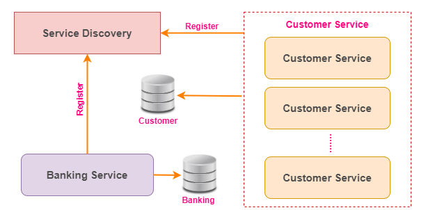
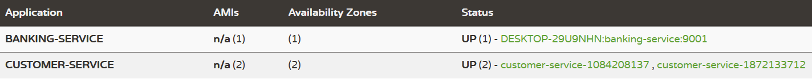

## Load balancing using Ribbon Client
If there are more instances are running for a particular service in a microservice architecture then It's very difficult to locate the service with static url. So, the load balancer will help us to identify the services quickly based on the service-name and share the load between number of instances running for a specific service.

* **Scaling:** The `customer-service` can be running with multiple instances (dynamic `instance-id` and `port`) and registered these service instances to the Eureka server.
* **Load Balancing:** Based on service-name it will locate the services and shared the workload to the number of instances running for the specific service.

### Architecture Diagram:
___
Please refer the below diagram to understand the architecture diagram of service load balancer working principle.



### Service Details:
___
I have created the below 3 services and didn't use any database to persist the data. Instead of that the data will be maintained in the service itself, and it will be lost once the server is restarted. Please refer the below table to know the details about each services.

|S.No| Service-Name| Port    | API                          | Database|
-----|-------------|---------|------------------------------|---------|
1| service-registry | 8761    | N/A                          | N/A    |
2| banking-service | 9001    | http://localhost:9001/banking | H2 DB   |
3| customer-service | dynamic | http://localhost:0/customer  | MySql DB|

### API Details:
___
Please refer the below list of APIs provided by the `banking-service`

**POST** http://localhost:9001/account

Payload:
```
{
    "name": "Arun",
    "amount": 2000.0,
    "phone": "xxxxxxxxxx",
    "email": "xxxx@gmail.com"
}
```
Response: 
```
{
    "status": "success",
    "message": "Successfully created the bank account",
    "customerId": 1,
    "accountNo": 45877048
}
```

**POST** http://localhost:9001/account/deposit

Payload:
```
{
    "customerId": 1,
    "accountNo": 45877048,
    "amount": 1000.0
}
```
Response: 
```
{
    "status": "success",
    "message": "Successfully updated the balance",
    "balance": 3000.0
}
```

**POST** http://localhost:9001/account/withdraw

Payload:
```
{
    "customerId": 1,
    "accountNo": 45877048,
    "amount": 500.0
}
```
Response: 
```
{
    "status": "success",
    "message": "Successfully updated the balance",
    "balance": 2500.0
}
```

**GET** http://localhost:9001/account/{custId}

Response: 
```
{
    "id": 1,
    "name": "Arun",
    "accountNo": 45877048,
    "balance": 4000.0,
    "phone": "xxxxxxxxxx",
    "emailId": "xxxx@gmail.com"
}
```

**GET** http://localhost:9001/account/checkBalance/{custId}

Response: ```Arun your account number 45877048 has balance Rs:2500.0```

**GET** http://localhost:9001/account/ministatement/{custId}

Response: 
```
{
    "name": "Arun",
    "customerId": 1,
    "accountNo": 45877048,
    "balance": 2500.0,
    "transactions": [
        {
        "customerId": 1,
        "accountNo": 45877048,
        "transactionType": "ACCOUNT_CREATED",
        "amount": 2000.0,
        "date": "16-10-2022 22:48:47",
        "id": 1
        },
        {
        "customerId": 1,
        "accountNo": 45877048,
        "transactionType": "CREDIT",
        "amount": 1000.0,
        "date": "16-10-2022 22:49:29",
        "id": 2
        },
        {
        "customerId": 1,
        "accountNo": 45877048,
        "transactionType": "DEBIT",
        "amount": 500.0,
        "date": "16-10-2022 22:49:49",
        "id": 3
        }
    ]
}
```

### Start and access Eureka server:
___
>**Note:** *We need to start the `service-registry` service before starting of any services(`banking-service` or `customer-service`) to be registered with Eureka server.*

Finally, the `customer-service` and `banking-service` are registered with Eureka server which is running on the URL http://localhost:8761/. You can access the URL from the browser to see the list of services registered with Eureka server.

Please refer the below screenshot for your reference.

