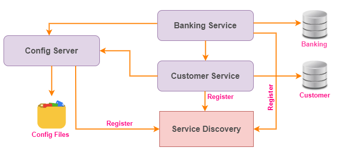
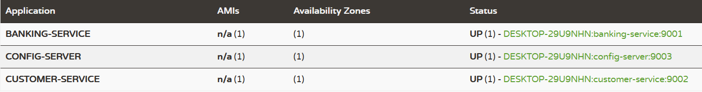

## Config server configuration using local file system
The configuration server allow to maintain the different profile with different configuration. This configuration can be accessed through HTTP url with different profile configuration. We can enable the profile to load its relevant configuration to the service im microservice. 

Usually we may use different database configuration for different environment in software development so, define the database configuration to its relevant profile and switch to different configuration by activating its relevant profile to the service.

### Architecture Diagram:
___
Please refer the below architecture diagram to understand the config server interaction in microservice architecture.


### Service Details:
___
I have created the below 4 services and specify the more details about the services

`service-registry`: It's responsible for registering all services into Eureka server for service discovery. It will help to locate the services very easily.

`config-server`: It's responsible for loading the configuration for all services. So, the configuration changes required in one common place and redeploy the service to reflect the changes in other services. It may be required to restart the services to reflect the configuration changes. 

`banking-services`: It's responsible for creating new account, deposit/withdraw the amount, get the customer details, check balance and monitor all transactions.

`customer-service`: It's responsible for all CURD operation related to customer


|S.No| Service-Name     | Port | API                            |H2-console| DB Url |
-----|------------------|------|--------------------------------|----------|--------|
1| service-registry | 8761 | N/A                            |N/A| N/A    |
2| config-server    | 9003 | N/A                            |N/A| N/A    |
3| banking-service  | 9001 | http://localhost:9001/account  |http://localhost:9001/h2-console| jdbc:h2:mem:banking |
4| customer-service | 9002 | http://localhost:9002/customer |http://localhost:9002/h2-console|jdbc:h2:mem:customer|

The `banking-service` profile activated in `config-server` as follows
1. http://localhost:9003/banking-service/default
2. http://localhost:9003/banking-service/dev
3. http://localhost:9003/banking-service/qa
4. http://localhost:9003/banking-service/prod

The `customer-service` profile activated in `config-server` as follows
1. http://localhost:9003/customer-service/default
2. http://localhost:9003/customer-service/dev
3. http://localhost:9003/customer-service/qa
4. http://localhost:9003/customer-service/prod

### API Details:
___
Please refer the below list of APIs provided by the `banking-service`

**POST** http://localhost:9001/account

Payload:
```
{
    "name": "Arun",
    "amount": 2000.0,
    "phone": "xxxxxxxxxx",
    "email": "xxxx@gmail.com"
}
```
Response: 
```
{
    "status": "success",
    "message": "Successfully created the bank account",
    "customerId": 1,
    "accountNo": 45877048
}
```

**POST** http://localhost:9001/account/deposit

Payload:
```
{
    "customerId": 1,
    "accountNo": 45877048,
    "amount": 1000.0
}
```
Response: 
```
{
    "status": "success",
    "message": "Successfully updated the balance",
    "balance": 3000.0
}
```

**POST** http://localhost:9001/account/withdraw

Payload:
```
{
    "customerId": 1,
    "accountNo": 45877048,
    "amount": 500.0
}
```
Response: 
```
{
    "status": "success",
    "message": "Successfully updated the balance",
    "balance": 2500.0
}
```

**GET** http://localhost:9001/account/{custId}

Response: 
```
{
    "id": 1,
    "name": "Arun",
    "accountNo": 45877048,
    "balance": 4000.0,
    "phone": "xxxxxxxxxx",
    "emailId": "xxxx@gmail.com"
}
```

**GET** http://localhost:9001/account/checkBalance/{custId}

Response: ```Arun your account number 45877048 has balance Rs:2500.0```

**GET** http://localhost:9001/account/ministatement/{custId}

Response: 
```
{
    "name": "Arun",
    "customerId": 1,
    "accountNo": 45877048,
    "balance": 2500.0,
    "transactions": [
        {
        "customerId": 1,
        "accountNo": 45877048,
        "transactionType": "ACCOUNT_CREATED",
        "amount": 2000.0,
        "date": "16-10-2022 22:48:47",
        "id": 1
        },
        {
        "customerId": 1,
        "accountNo": 45877048,
        "transactionType": "CREDIT",
        "amount": 1000.0,
        "date": "16-10-2022 22:49:29",
        "id": 2
        },
        {
        "customerId": 1,
        "accountNo": 45877048,
        "transactionType": "DEBIT",
        "amount": 500.0,
        "date": "16-10-2022 22:49:49",
        "id": 3
        }
    ]
}
```

Actually the above APIs are internally make a call to `customer-service` to fetch the actual response. The `customer-service` also exposed the APIs which can be accessed directly.

Please refer the below list of APIs provided by the `customer-service`

**GET** http://localhost:9002/customer/

Response: 
```
[
  {
    "id": 1,
    "name": "Arun",
    "accountNo": 45877048,
    "balance": 2000.0,
    "phone": "xxxxxxxxxx",
    "emailId": "xxxx@gmail.com"
  }
]
```

**GET** http://localhost:9002/customer/{custId}

Response: 
```
{
    "id": 1,
    "name": "Arun",
    "accountNo": 45877048,
    "balance": 2000.0,
    "phone": "xxxxxxxxxx",
    "emailId": "xxxx@gmail.com"
}
```

**POST** http://localhost:9002/customer

Payload:
```
{
    "name":"Arun",
    "amount": 2000.0,
    "phone":"xxxxxxxxxx",
    "emailId":"xxxx@gmail.com"
}
```
Response: 
```
{
    "id": 1,
    "name": "Arun",
    "accountNo": 45877048,
    "balance": 2000.0,
    "phone": "xxxxxxxxxx",
    "emailId": "xxxx@gmail.com"
}
```

**PUT** http://localhost:9002/customer/{custId}

Payload:
```
{
    "id": 1,
    "accountNo": 45877048,
    "amount": 5000.0
}
```
Response: 
```
{
    "id": 1,
    "name": "Arun",
    "accountNo": 45877048,
    "balance": 5000.0,
    "phone": "xxxxxxxxxx",
    "emailId": "xxxx@gmail.com"
}
```

**DELETE** http://localhost:9002/customer/{custId}

Response: ```None```

### Start and access Eureka server:
___
>**Note:** *We need to start the `service-registry` service before starting of any services(`banking-service`/`customer-service`) to be registered with Eureka server.*

Finally, the `banking-service` and `customer-service` are registered with Eureka server which is running on the URL http://localhost:8761/. You can access the URL from the browser to see the list of services registered with Eureka server.

Please refer the below screenshot for your reference.
