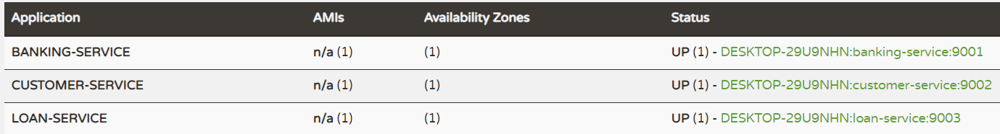

## Microservices interact with Oracle Database
Each service can have its own database to store the data which will avoid tight coupling between services. This example shows the interaction between microservices and the Oracle database.

The below microservice design pattern used for this example
1. **Service per Database:** Each service has its own database to store the data and also, it has the ability to run the application individually without having the dependency with other services (loosely coupled)
2. **Aggregate Pattern:** The `banking-service` can interact with other services to construct the expected response to the client.

### Process of service interaction to Oracle Database:
___
Please refer the below architecture diagram to understand about the services interacting with Oracle database.


### Service Details:
___
First we have to download the Oracle server from [Oracle download](https://www.oracle.com/database/technologies/xe18c-downloads.html) link then, follow the instructions from [Oracle Setup](https://docs.oracle.com/cd/F32325_01/doc.192/f32326/t_preinstall_oracle_db_configuration.htm#SIMIG-DatabaseConfiguration-305E8CD8) page.
Once the Oracle DB setup was done then, update the DB credentials to all the services through configuration. Otherwise, you may face database connectivity issue from the services

I have created the below 4 services and specify the more details about the services

`service-registry`: It's responsible for registering all services into Eureka server for service discovery. It will help to locate the services very easily.

`banking-services`: It's responsible for creating new account, deposit/withdraw the amount, apply for loan, get the customer details, check balance and monitor all transactions.

`customer-service`: It's responsible for all CURD operation related to customer

`loan-service`: It's responsible for check for loan eligibility, approve/decline the loan, validating the customer details, save and monitor all loan transactions.

|S.No| Service-Name|Port| API                            |
-----|-------------|----|--------------------------------|
1| service-registry|8761| N/A                            |
2| banking-service|9001| http://localhost:9001/account  |
3| customer-service|9002| http://localhost:9002/customer |
4| loan-service|9003| http://localhost:9003/loan     |

### API Details:
___
Please refer the below list of APIs provided by the `banking-service`

**POST** http://localhost:9001/account

Payload:
```
{
    "name": "Arun",
    "amount": 2000.0,
    "phone": "xxxxxxxxxx",
    "email": "xxxx@gmail.com"
}
```
Response: 
```
{
    "status": "success",
    "message": "Successfully created the bank account",
    "customerId": 1,
    "accountNo": 45877048
}
```

**POST** http://localhost:9001/account/deposit

Payload:
```
{
    "customerId": 1,
    "accountNo": 45877048,
    "amount": 1000.0
}
```
Response: 
```
{
    "status": "success",
    "message": "Successfully updated the balance",
    "balance": 3000.0
}
```

**POST** http://localhost:9001/account/withdraw

Payload:
```
{
    "customerId": 1,
    "accountNo": 45877048,
    "amount": 500.0
}
```
Response: 
```
{
    "status": "success",
    "message": "Successfully updated the balance",
    "balance": 2500.0
}
```

**POST** http://localhost:9001/account/loan

Payload:
```
{
    "name":"Arun",
    "age": 39,
    "custId":1,
    "accountNo": 45877048,
    "income": 30000,
    "employmentType": "MNC",
    "amount": 200000.0,
    "tenture": 24
}
```
Response: 
```
{
"id": 1,
"status": "ACCEPTED",
"message": "You are eligible for the loan",
"amount": 200000.0,
"tenture": 24
}
```

**GET** http://localhost:9001/account/{custId}

Response: 
```
{
    "id": 1,
    "name": "Arun",
    "accountNo": 45877048,
    "balance": 4000.0,
    "phone": "xxxxxxxxxx",
    "emailId": "xxxx@gmail.com",
    "loanDetails": [
      {
        "id": 1,
        "amount": 200000.0,
        "tenture": 24,
        "customerId": 1,
        "accountNo": 45877048
      }
    ]
}
```

**GET** http://localhost:9001/account/checkBalance/{custId}

Response: ```Arun your account number 45877048 has balance Rs:2500.0```

**GET** http://localhost:9001/account/ministatement/{custId}

Response: 
```
{
    "name": "Arun",
    "customerId": 1,
    "accountNo": 45877048,
    "balance": 2500.0,
    "transactions": [
      {
        "customerId": 1,
        "accountNo": 45877048,
        "transactionType": "ACCOUNT_CREATED",
        "amount": 2000.0,
        "updateDate": "16-10-2022 22:48:47",
        "id": 1
      },
      {
        "customerId": 1,
        "accountNo": 45877048,
        "transactionType": "CREDIT",
        "amount": 1000.0,
        "updateDate": "16-10-2022 22:49:29",
        "id": 2
      },
      {
        "customerId": 1,
        "accountNo": 45877048,
        "transactionType": "DEBIT",
        "amount": 500.0,
        "updateDate": "16-10-2022 22:49:49",
        "id": 3
      }
    ]
}
```

Actually the above APIs are internally make a call to `customer-service` and `loan-service` to fetch the actual response. The `customer-service` also exposed the APIs which can be accessed directly.

Please refer the below list of APIs provided by the `customer-service`

**GET** http://localhost:9002/customer/

Response: 
```
[
  {
    "id": 1,
    "name": "Arun",
    "accountNo": 45877048,
    "balance": 2000.0,
    "phone": "xxxxxxxxxx",
    "emailId": "xxxx@gmail.com"
  }
]
```

**GET** http://localhost:9002/customer/{custId}

Response: 
```
{
    "id": 1,
    "name": "Arun",
    "accountNo": 45877048,
    "balance": 2000.0,
    "phone": "xxxxxxxxxx",
    "emailId": "xxxx@gmail.com"
}
```

**POST** http://localhost:9002/customer

Payload:
```
{
    "name":"Arun",
    "amount": 2000.0,
    "phone":"xxxxxxxxxx",
    "emailId":"xxxx@gmail.com"
}
```
Response: 
```
{
    "id": 1,
    "name": "Arun",
    "accountNo": 45877048,
    "balance": 2000.0,
    "phone": "xxxxxxxxxx",
    "emailId": "xxxx@gmail.com"
}
```

**PUT** http://localhost:9002/customer/{custId}

Payload:
```
{
    "id": 1,
    "accountNo": 45877048,
    "amount": 5000.0
}
```
Response: 
```
{
    "id": 1,
    "name": "Arun",
    "accountNo": 45877048,
    "balance": 5000.0,
    "phone": "xxxxxxxxxx",
    "emailId": "xxxx@gmail.com"
}
```

**DELETE** http://localhost:9002/customer/{custId}

Response: ```None```

Please refer the below list of APIs provided by the `loan-service`

**GET** http://localhost:9003/loan

Response: 
```
[
  {
    "id": 1,
    "amount": 200000.0,
    "tenture": 24,
    "customerId": 1,
    "accountNo": 45877048
  }
]
```

**GET** http://localhost:9003/loan/{loanId}

Response: 
```
{
    "id": 3,
    "amount": 200000.0,
    "tenture": 24,
    "customerId": 1,
    "accountNo": 45877048
}
```

**POST** http://localhost:9003/loan

Payload:
```
{
    "name":"Arun",
    "age": 39,
    "custId":1,
    "accountNo": 45877048,
    "income": 40000,
    "employmentType": "MNC",
    "amount": 250000.0,
    "tenture": 36
}
```
Response: 
```
{
    "id": 5,
    "status": "ACCEPTED",
    "message": "You are eligible for the loan",
    "amount": 250000.0,
    "tenture": 36
}
```

**PUT** http://localhost:9003/loan/{loanId}

Payload:
```
{
    "amount": 350000.0,
    "tenture": 48
}
```
Response: 
```
{
    "id": 1,
    "amount": 350000.0,
    "tenture": 48,
    "customerId": 1,
    "accountNo": 45877048
}
```

**DELETE** http://localhost:9003/loan/{loanId}

Response: ```None```

**GET** http://localhost:9003/loan/transaction

Response: 
```
[
  {
    "loanId": 2,
    "status": "ACCEPTED",
    "message": "You are eligible for the loan",
    "amount": 250000.0,
    "tenture": 36,
    "updateDate": "16-10-2022 23:19:22"
  },
  {
    "loanId": 3,
    "status": "REJECTED",
    "message": "You are not eligible for loan",
    "amount": 0.0,
    "tenture": 0,
    "updateDate": "16-10-2022 23:23:16"
  },
  {
    "loanId": 5,
    "status": "ACCEPTED",
    "message": "You are eligible for the loan",
    "amount": 400000.0,
    "tenture": 48,
    "updateDate": "16-10-2022 23:23:44"
  },
  {
    "loanId": 6,
    "status": "CLOSED",
    "message": "You have closed the loan",
    "amount": 0.0,
    "tenture": 0,
    "updateDate": "16-10-2022 23:24:23"
  }
]
```

### Start and access Eureka server:
___
>**Note:** *We need to start the `service-registry` service before starting of any services(`banking-service`/`customer-service`/`loan-service`) to be registered with Eureka server.*

Finally, the `banking-service`, `customer-service` and `loan-service` are registered with Eureka server which is running on the URL http://localhost:8761/. You can access the URL from the browser to see the list of services registered with Eureka server.

Please refer the below screenshot for more reference.
