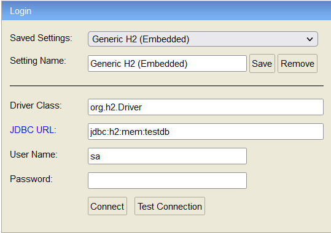

## Initially load data to H2 Database using CommandLineRunner
Some scenario, we have to create the required table and load the data to the database which will be used by the Microservice. So, we can use the commandLineRunner to load initial data to the database once the service has initialized during the startup.

### Service Details:
___
I have created the below service and didn't use any database to persist the data. Instead of that the data will be maintained in the service itself, and it will be lost once the server is restarted. Please refer the below table to know the details about each services.

|S.No| Service-Name| Port    | API                            | Database|
-----|-------------|---------|--------------------------------|---------|
1| customer-service | dynamic | http://localhost:9002/customer | H2 DB|

Once the application was started then, we need to validate the data was successfully inserted into database or not. So, First we need to connect the database through [h2-console](http://localhost:9002/h2-console/) by using the below configuration



Once it is connected then, execute the `select * from customer` query to verify all inserted data was present in the `customer` table.


### API Details:
___
Please refer the below list of APIs provided by the `customer-service`

**GET** http://localhost:9002/customer/

Response:
```
[
  {
    "id": 1,
    "name": "Arun",
    "accountNo": 45877048,
    "balance": 2000.0,
    "phone": "xxxxxxxxxx",
    "emailId": "xxxx@gmail.com"
  }
]
```

**GET** http://localhost:9002/customer/{custId}

Response:
```
{
    "id": 1,
    "name": "Arun",
    "accountNo": 45877048,
    "balance": 2000.0,
    "phone": "xxxxxxxxxx",
    "emailId": "xxxx@gmail.com"
}
```

**POST** http://localhost:9002/customer

Payload:
```
{
    "name":"Arun",
    "amount": 2000.0,
    "phone":"xxxxxxxxxx",
    "emailId":"xxxx@gmail.com"
}
```
Response:
```
{
    "id": 1,
    "name": "Arun",
    "accountNo": 45877048,
    "balance": 2000.0,
    "phone": "xxxxxxxxxx",
    "emailId": "xxxx@gmail.com"
}
```

**PUT** http://localhost:9002/customer/{custId}

Payload:
```
{
    "id": 1,
    "accountNo": 45877048,
    "amount": 5000.0
}
```
Response:
```
{
    "id": 1,
    "name": "Arun",
    "accountNo": 45877048,
    "balance": 5000.0,
    "phone": "xxxxxxxxxx",
    "emailId": "xxxx@gmail.com"
}
```

**DELETE** http://localhost:9002/customer/{custId}

Response: ```None```