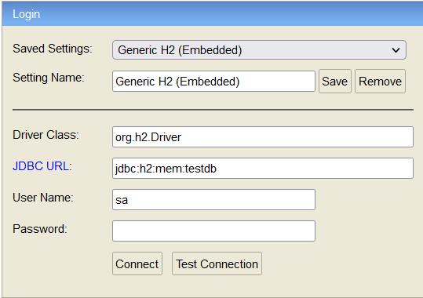
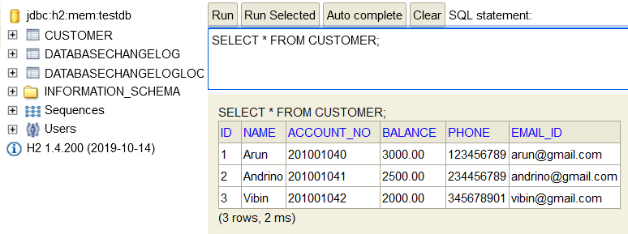
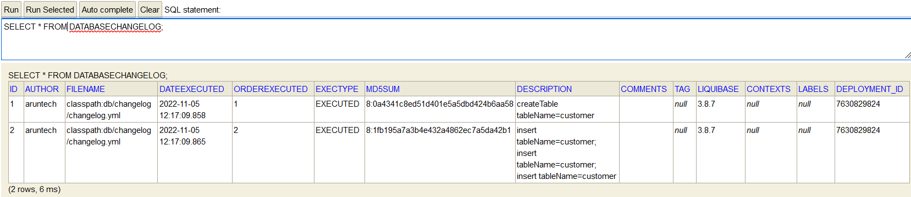
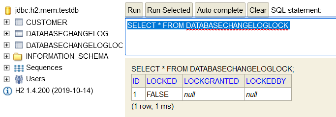

## Initially load data to H2 Database using Liquibase
Some scenario, we have to create the required table and load the data to the database which will be used by the Microservice. It has also required to monitor the db script execution status to understand the state of the data and debugging the failures. 

### Service Details:
___
I have created the below service and didn't use any database to persist the data. Instead of that the data will be maintained in the service itself, and it will be lost once the server is restarted. Please refer the below table to know the details about each services.

|S.No| Service-Name| Port    | API                            | Database|
-----|-------------|---------|--------------------------------|---------|
1| customer-service | dynamic | http://localhost:9002/customer | H2 DB|

Once the application was started then, we need to validate the data was successfully inserted into database or not. So, First we need to connect the database through [h2-console](http://localhost:9002/h2-console/) by using the below configuration



Once it is connected then, follow the below steps to validate the db changes
1. Execute ```SELECT * FROM CUSTOMER;``` query to validate the schema and the value inserted into the table
   
   
2. Execute the ```SELECT * FROM DATABASECHANGELOG;``` query to validate the execution of the db queries.
   
   
3. Execute the ```SELECT * FROM DATABASECHANGELOGLOCK;``` query to verify the lock status of the database 
   
   

We can also validate the db query execution status through actuator [endpoint](http://localhost:9002/actuator/liquibase).
```
{
  "contexts": {
    "customer-service": {
        "liquibaseBeans": { 
            "liquibase": {
                "changeSets": [
                  {
                    "author":"aruntech",
                    "changeLog":"classpath:db/changelog/changelog.yml",
                    "comments":"",
                    "contexts":[],
                    "dateExecuted":"2022-11-05T06:47:09.858Z",
                    "deploymentId":"7630829824",
                    "description":"createTable tableName=customer",
                    "execType":"EXECUTED",
                    "id":"1",
                    "labels":[],
                    "checksum":"8:0a4341c8ed51d401e5a5dbd424b6aa58",
                    "orderExecuted":1,
                    "tag":null
                  },{
                    "author":"aruntech",
                    "changeLog":"classpath:db/changelog/changelog.yml",
                    "comments":"",
                    "contexts":[],
                    "dateExecuted":"2022-11-05T06:47:09.865Z",
                    "deploymentId":"7630829824",
                    "description":"insert tableName=customer; insert tableName=customer; insert tableName=customer",
                    "execType":"EXECUTED",
                    "id":"2",
                    "labels":[],
                    "checksum":"8:1fb195a7a3b4e432a4862ec7a5da42b1",
                    "orderExecuted":2,
                    "tag":null
                  }
                ]}
            },
            "parentId":null
        }
    }
  }
```
### API Details:
___
Please refer the below list of APIs provided by the `customer-service`

**GET** http://localhost:9002/customer/

Response:
```
[
  {
    "id": 1,
    "name": "Arun",
    "accountNo": 45877048,
    "balance": 2000.0,
    "phone": "xxxxxxxxxx",
    "emailId": "xxxx@gmail.com"
  }
]
```

**GET** http://localhost:9002/customer/{custId}

Response:
```
{
    "id": 1,
    "name": "Arun",
    "accountNo": 45877048,
    "balance": 2000.0,
    "phone": "xxxxxxxxxx",
    "emailId": "xxxx@gmail.com"
}
```

**POST** http://localhost:9002/customer

Payload:
```
{
    "name":"Arun",
    "amount": 2000.0,
    "phone":"xxxxxxxxxx",
    "emailId":"xxxx@gmail.com"
}
```
Response:
```
{
    "id": 1,
    "name": "Arun",
    "accountNo": 45877048,
    "balance": 2000.0,
    "phone": "xxxxxxxxxx",
    "emailId": "xxxx@gmail.com"
}
```

**PUT** http://localhost:9002/customer/{custId}

Payload:
```
{
    "id": 1,
    "accountNo": 45877048,
    "amount": 5000.0
}
```
Response:
```
{
    "id": 1,
    "name": "Arun",
    "accountNo": 45877048,
    "balance": 5000.0,
    "phone": "xxxxxxxxxx",
    "emailId": "xxxx@gmail.com"
}
```

**DELETE** http://localhost:9002/customer/{custId}

Response: ```None```