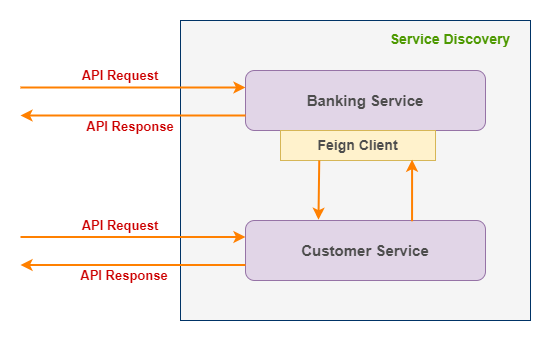
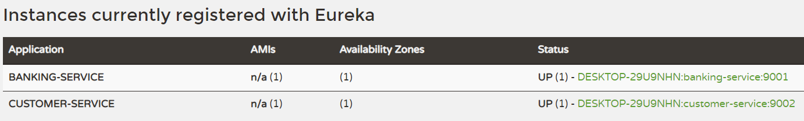

## Interacting with microservices using FeignClient
Service to service interaction will be happened in microservice architecture because one API request required to gethered data from different services and send the final response to the client for further processing. The interaction can be happened through below approaches
1. Blocking I/O (through http request by using FeignClient or FeignClient)
2. Non-blocking I/O (through message queue like RabbitMQ, Apache Kafka etc.)

### Architecture Diagram:
___
Please refer the below architecture diagram to understand the process of FeignClient working with microservice.



### Service Details:
___
I have created the below 3 services and didn't use any database to persist the data. Instead of that the data will be maintained in the service itself, and it will be lost once the server is restarted. Please refer the below table to know the details about each services.

|S.No| Service-Name|Port| API|
-----|-------------|----|----|
1| service-registry |8761|N/A|
2| banking-service |9001|http://localhost:9001/banking|
3| customer-service |9002|http://localhost:9002/customer|

### API Details:
___
Please refer the below list of APIs provided by the `banking-service`

**POST** http://localhost:9001/banking/addAccount

Payload:
```
{
    "name": "Arun",
    "amount": 2000.0,
    "phone": "xxxxxxxxxx",
    "email": "xxxx@gmail.com"
}
```
Response: 
```
{
    "status": "success",
    "message": "Successfully created the bank account",
    "customerId": 139673,
    "accountNo": 22664411
}
```

**POST** http://localhost:9001/banking/deposit

Payload:
```
{
    "customerId": 373495,
    "accountNo": 42813189,
    "amount": 1000.0
}
```
Response: 
```
{
    "status": "success",
    "message": "Successfully updated the balance",
    "balance": 3000.0
}
```

**POST** http://localhost:9001/banking/withdraw

Payload:
```
{
    "customerId": 139673,
    "accountNo": 22664411,
    "amount": 1000.0
}
```
Response: 
```
{
    "status": "success",
    "message": "Successfully updated the balance",
    "balance": 1000.0
}
```

**GET** http://localhost:9001/banking/customer/{custId}

Response: 
```
{
    "id": 994711,
    "name": "Arun",
    "accountNo": 97529868,
    "balance": 2500.0,
    "phone": "xxxxxxxxxx",
    "emailId": "xxxx@gmail.com"
}
```

**GET** http://localhost:9001/banking/checkBalance/{custId}

Response: ```Arun your account number 97529868 has balance Rs:2500.0```

Actually the above APIs are internally make a call to `customer-service` to fetch the actual response. The `customer-service` also exposed the APIs which can be accessed directly.

Please refer the below list of APIs provided by the `customer-service`

**GET** http://localhost:9002/customer/

Response: 
```
[
  {
    "id": 746310,
    "name": "Arun",
    "accountNo": 46102620,
    "balance": 2000.0,
    "phone": "xxxxxxxxxx",
    "emailId": "xxxx@gmail.com"
  }
]
```

**GET** http://localhost:9002/customer/{custId}

Response: 
```
{
    "id": 746310,
    "name": "Arun",
    "accountNo": 46102620,
    "balance": 2000.0,
    "phone": "xxxxxxxxxx",
    "emailId": "xxxx@gmail.com"
}
```

**POST** http://localhost:9002/customer

Payload:
```
{
    "name":"Arun",
    "amount": 2000.0,
    "phone":"xxxxxxxxxx",
    "emailId":"xxxx@gmail.com"
}
```
Response: 
```
{
    "id": 746310,
    "name": "Arun",
    "accountNo": 46102620,
    "balance": 2000.0,
    "phone": "xxxxxxxxxx",
    "emailId": "xxxx@gmail.com"
}
```

**PUT** http://localhost:9002/customer/{custId}

Payload:
```
{
    "id": 746310,
    "accountNo": 46102620,
    "amount": 5000.0
}
```
Response: 
```
{
    "id": 746310,
    "name": "Arun",
    "accountNo": 46102620,
    "balance": 5000.0,
    "phone": "xxxxxxxxxx",
    "emailId": "xxxx@gmail.com"
}
```

**DELETE** http://localhost:9002/customer/{custId}

Response: ```None```

### Start and access Eureka server:
___
>**Note:** *We need to start the `service-registry` service before starting of any services(`banking-service` or `customer-service`) to be registered with Eureka server.*

Finally, the `customer-service` and `banking-service` are registered with Eureka server which is running on the URL http://localhost:8761/. You can access the URL from the browser to see the list of services registered with Eureka server.

Please refer the below screenshot for more reference.
