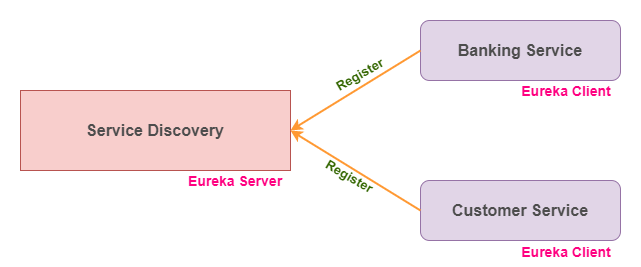
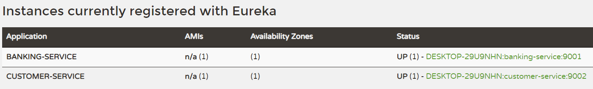

## Registering the services to Eureka Server for service discovery
Usually all services has to be registered with the Eureka server in microservice architecture which enable to easily locate the services within the application and also transfer the API request to the respective services.

### Architecture Diagram:
___
Please refer the below diagram to understand the process of service discovery


### Service Details:
___
I have created the below 3 services and specify the port which is running on each services

|S.No| Service-Name|Port| API|
-----|-------------|----|----|
1| service-registry |8761|N/A|
2| banking-service |9001|http://localhost:9001/banking|
3| customer-service |9002|http://localhost:9002/customer|

### API Details:
___
The API for `banking-service` as follows

**GET** http://localhost:9001/banking

Response: ```Bank Service```

The API for `customer-service` as follows

**GET** http://localhost:9002/customer

Response: ```Customer Service```

### Start and access Eureka server:
___
>**Note:** *We need to start the `service-registry` service before starting of any services(`banking-service` or `customer-service`) to be registered with Eureka server.*

Finally, the `customer-service` and `banking-service` are registered with Eureka server which is running on the URL http://localhost:8761/. You can access the URL from the browser to see the list of services registered with Eureka server.

Please refer the below screenshot for more reference.
